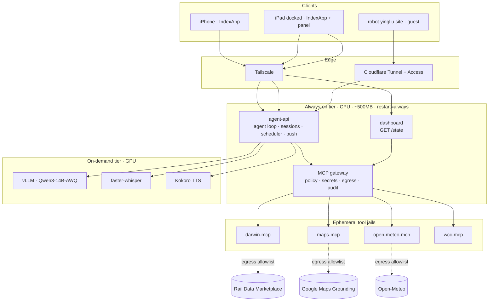
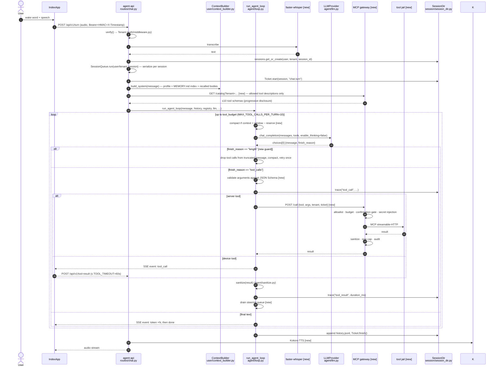
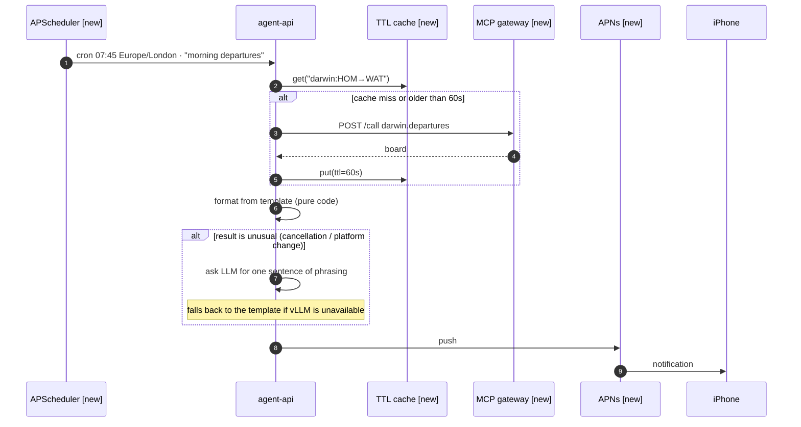
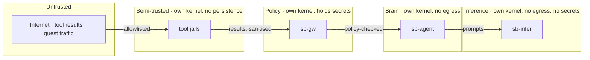

# SecondBrain — System Design v2

> **Version documented:** working tree at `feat/traceable-session-ids` (47e9c71), 16 Sept 2026 · @Ying Liu
> **Method:** read-only audit of `agent-api/app/**` cross-checked against `ANALYSIS.md` (2026-06-13) and `docker-compose.yml`, folded together with the *Jarvis — Personal Assistant System Design* requirements (16 Sept 2026) and a structural read of the **Pi agent harness** (`open_source_agents/pi`, `SYSTEM_DESIGN.md` @ 0.84.4).
> **Status of each section:** `[live]` exists in the tree today · `[new]` designed here, not built · `[change]` exists but is being replaced.
> Where this document contradicts `README.md`, `PLAN.md` or `.claude/skills/second-brain/PROJECT_STRUCTURE.md`, this document is the newer one — those three are known-stale (ANALYSIS.md §3.7).

---

## 1. Executive Summary

**What SecondBrain is today.** A single FastAPI process (`agent-api`) on one GPU box, fronted by a Cloudflare Tunnel, talking to a local vLLM serving Qwen3-14B-AWQ. An iPhone client (IndexApp) opens an SSE stream per turn; the server runs an agent loop, executes server-side skills in-process, and delegates device skills (Calendar, Reminders, Contacts, Clipboard) back over the same stream. Multi-tenancy ("entries") and a remote-MCP client landed in `feat/mcp-tenants`; session directories with tickets and trace logs landed in `feat/traceable-session-ids`.

**What v2 adds.** Four things, in dependency order:

1. **An MCP gateway** `[new]` — a separate process that owns every outbound tool call, every tool credential, and every egress decision. `agent-api` loses its internet reach and its secret store.
2. **A deterministic tier** `[new]` — scheduler, event ingress, TTL cache and push, so useful work happens without the model being up. SecondBrain currently has *no* code path that runs without an LLM.
3. **microVM isolation** `[change]` — Docker Compose is replaced by per-role microVMs, which removes the highest-severity finding in `ANALYSIS.md` (the Docker socket mounted into the internet-facing container) by construction rather than by policy.
4. **Harness maturity borrowed from Pi** `[new]` — context compaction, a hook lifecycle, tool-argument validation, steering, and progressive tool disclosure. §9 is the itemised register.

**Design principles.** Four, and every decision below traces to one:

| # | Principle | Consequence |
|---|---|---|
| 1 | **Deterministic work never touches the model.** | Scheduled jobs, dashboard data, filtering and formatting are code. The LLM phrases and reasons; it does not fetch or sort. |
| 2 | **One orchestrator, thin clients.** | All conversation state lives server-side. IndexApp's SwiftData store becomes a display cache, not a source of truth. |
| 3 | **Degradation is designed.** | The GPU tier can be down without the system being down. Every capability has a named fallback (§7). |
| 4 | **The model's reach is a gateway property, not a prompt property.** | "Don't call that tool" is enforced at the gateway with an allowlist, not asked for in the system prompt. |

Principle 4 is the one that is genuinely new. Today, `SYSTEM_PROMPT` (`agent-api/app/config.py`) carries five numbered "SECURITY RULES — NEVER VIOLATE" lines. Those are hints to a 14B model, not controls. v2 moves each of them to a place where it is mechanically true.

**Non-goals** (unchanged from the Jarvis scope): multi-*user* identity beyond per-key tenants; home automation; client-side offline operation; App Store distribution; any write/booking/purchase action against an external service without an explicit confirmation gate.

**Tech stack.**

| Concern | Today `[live]` | v2 |
|---|---|---|
| Orchestrator | Python 3.12, FastAPI, Uvicorn, SSE | unchanged |
| Inference | vLLM 0.11.0, Qwen3-14B-AWQ, hermes tool parser | unchanged; non-thinking default stays (`LLM_ENABLE_THINKING=false`) |
| Tool transport | MCP streamable-HTTP, short-lived session per call (`app/mcp/client.py`) | unchanged client; **gateway inserted in front** |
| Tool policy | `data/tenants.json` read by agent-api | moved into the gateway |
| Scheduling | none | APScheduler in-process |
| Cache | none | TTL cache backing `GET /state` |
| Persistence | session dirs + JSONL (`app/session/session_dir.py`), file-backed memory (`app/user/memory.py`) | + compaction entries, + branch summaries |
| Isolation | Docker Compose, 4–5 containers, shared bridge networks | Cloud Hypervisor / Firecracker microVMs, one role per VM |
| Ingress | Cloudflare Tunnel + Bearer + HMAC + timestamp | + Tailscale for LAN/home clients; tunnel retained for the public guest endpoint only |
| Push | none | APNs direct (developer-signed build) |
| Voice | on-device WhisperKit STT + AVSpeechSynthesizer TTS | server-side faster-whisper + Kokoro, on-device retained as fallback |

**Capability targets for v2.** Train departures (Darwin LDBWS), place search (Maps Grounding Lite), weather (Open-Meteo), and conversational voice on iPhone + docked iPad — all four reached through the gateway, none of them reached directly by `agent-api`.

---

## 2. Architecture Flow

### 2.1 Tier map

Two process tiers with different availability requirements, plus a jail tier that exists only while a tool runs.



Two arrows in that diagram carry most of the design:

- **`D --> G`** — the dashboard reaches the gateway directly, never through the model. A departure board is a data fetch, not a prompt. This is principle 1 drawn as an edge.
- **`H --> G`** as the *only* line leaving `agent-api` toward the outside. Today `agent-api` holds every MCP auth token (`data/tenants.json`), carries `host.docker.internal` in its SSRF allowlist (`app/config.py`), sits on three Docker networks including `tunnel_network`, and mounts `/var/run/docker.sock`. In v2 it holds no external credential and has no route to the internet.

### 2.2 Why two tiers

| Tier | Contains | Footprint | Restart policy |
|---|---|---|---|
| Always-on | agent-api, scheduler, gateway, dashboard | ~500 MB RAM, CPU only | `restart: always`, boots with the host |
| On-demand | vLLM, Whisper, TTS | full GPU, ~22 GB VRAM | manual or lazy load |
| Jail | one MCP tool server | 64–256 MB, seconds of life | spawned per call or per tool session |

Collapsing to one machine makes the server a single point of failure. The tier split stops it being a single point of *total* failure: the 08:12 train push still fires while vLLM is rebuilding, out of VRAM, or unloaded. This is principle 1 re-expressed as a process boundary — and it is the thing SecondBrain most conspicuously lacks today, where an unreachable vLLM means every endpoint except `/health` returns an apology string (`app/agent/loop.py:70-84`).

### 2.3 Sequence — one conversational voice turn

Real identifiers from the tree; `[new]` marks participants that do not exist yet.



Three things in that diagram are corrections to today's loop rather than additions:

- **Argument validation does not exist, and the failure mode is silent execution.** `loop.py` did `json.loads(tc["function"]["arguments"])` with `except json.JSONDecodeError: arguments = {}`, then passed that straight to `skill.execute(tool_name, arguments)`. A tool call whose argument JSON the model truncated or malformed therefore ran **with no arguments at all** — a `create_calendar_event` with no title, no date, no calendar. vLLM's tool parsers emit `finish_reason="tool_calls"` alongside partial argument JSON, so this is reachable in ordinary operation. *(Fixed 17 Sept: the loop now fails closed and hands the model an error it can retry from.)*
- **`finish_reason == "length"`** is read at `app/agent/loop.py:87` and never branched on. Pi discards every tool call in a truncated assistant message (`failToolCallsFromTruncatedMessage`). **A correction to an earlier draft of this document:** the length path was *not* the route to argument-less execution — the tool-call branch required `finish_reason == "tool_calls"`, so a truncated message fell through to the final-text path and produced a dead-end apology instead. The bug above is the real one; this is the robustness gap. Both are worth closing, for different reasons. *(Fixed 17 Sept: truncated messages are discarded and the turn re-asked without tools.)*
- **Compaction** does not exist. `loop.py:57` is `history[-20:]` — a hard window. At message 21 the assistant silently forgets turn 1 with no summary and no signal to the user. For a coding agent that is annoying; for an assistant whose whole value is remembering your usual station, it is the product failing.
- **The tool batch is serial.** `loop.py:93` awaits each call in turn. Two independent lookups in one turn cost twice what they should, against a budget measured in single seconds (§4.8).

### 2.4 Sequence — one proactive event (no model in the path)



The model is optional in this path and appears exactly once, for phrasing. That is the whole point of the tier split, and the exit criterion for build Phase 2 (§10): a useful notification arrives without anything being asked, and without the GPU necessarily being up.

### 2.5 Control points

The places where behaviour is decided, with today's location and v2's.

| Point | Today `[live]` | v2 |
|---|---|---|
| Tenant resolution | `auth/middleware.py:verify()` — Bearer identifies the tenant, HMAC must be keyed with the same tenant key | unchanged; HMAC extended to cover method+path (see §6) |
| Session serialization | `SessionQueue.run(f"{user}/{tenant}_{session_id}")` in `routes/chat.py` | unchanged — already the right shape |
| Prompt composition | `ContextBuilder.build_system()` — base prompt + profile + memory index + ≤3 recalled bodies | + compaction summary, + branch summary |
| Context window | `loop.py:57` `history[-20:]` | `build_context_entries()` — compaction-aware walk `[new]` |
| Tool visibility | `SkillRegistry.get_tools_for_query()` keyword prefilter + tenant `allowed_skill_names()` | gateway-issued catalog, tenant-scoped, progressively disclosed `[new]` |
| Tool budget | `tool_budget = max_tools or MAX_TOOLS` (`loop.py:55`) — a *loop-iteration* cap, not a tool-count cap | both, and named apart: `max_tool_rounds` vs `max_tools_in_context` `[change]` |
| Tool execution | `registry.execute_server_tool()` in-process, or SSE round-trip to the device | in-process (device-adjacent only) or gateway `[change]` |
| Egress | anywhere `httpx` can reach; SSRF guard is `app/mcp/ssrf.py`, bypassed by `allow_private` and `MCP_ALLOWED_PRIVATE_HOSTS` | agent-api VM has no default route; gateway holds a per-tool destination allowlist `[change]` |
| Truncation guard | none | `finish_reason == "length"` → drop tool calls, compact, retry once `[new]` |
| Confirmation gate | a sentence in `SYSTEM_PROMPT` | gateway-side `requires_confirmation` on the tool descriptor `[new]` |
| Loop exhaustion | one final no-tools LLM call for a wrap-up summary, then `_tool_outcome_line()` (`loop.py:176-207`) | unchanged — this is already good, keep it |

The `MAX_TOOLS` naming collision is worth fixing before it causes a bad decision. Commit 47e9c71 raised it to 10 "across config, compose, and tenant example"; `config.py` reads it from `MAX_TOOL_CALLS_PER_TURN` and `loop.py:55` spends it as loop iterations. The Jarvis brief's "keep the exposed tool count under 10" and "cap tool rounds at three per turn" are two different numbers that currently share one variable. v2 sets `max_tool_rounds = 3` for voice turns and `max_tools_in_context = 10`, enforced in different places.

---

## 3. State & Memory Management

Four layers, of which SecondBrain has three and a half. Pi's contribution here is the missing half: a durable transcript that is a *tree* with *compaction*, not a list with a window.

### 3.1 In-memory run state `[live]`

Held for the life of one turn inside `run_agent_loop`:

```python
messages:   list[dict]   # system + history[-20:] + assistant/tool turns
tool_defs:  list[dict]   # from registry.get_tools_for_query(message, allowed)
server_tools, device_tools: set[str]
tool_runs:  list[dict]   # [{name, ok}] — feeds _tool_outcome_line()
```

Two module-level dicts (`tool_result_events`, `tool_results` in `agent/loop.py`) carry the iPhone hand-off. They leak an entry on the timeout race — `tool_results.pop(tc_id, None)` belongs in the `finally` alongside the existing `tool_result_events.pop` (ANALYSIS.md §1.10, still open at 47e9c71).

Per-request context (`ContextVar`s in `skills/base.py`) gives skills the active session and user without a shared singleton. That is the right pattern and generalises cleanly to the hook bus in §4.4.

### 3.2 Durable state — the session directory `[live]`

`app/session/session_dir.py`, one directory per `{user_id}_{session_id}`:

```
data/sessions/{user}_{sess_2026-09-16_074512_a1b2}/
    session.json      # metadata + forward-only state machine (session/state.py)
    history.jsonl     # append-only LLM conversation log
    workspace/        # agent-produced files
    memory/           # session-scope durable facts (MemoryStore)
    ipc/              # atomic-rename handoff
    tickets/          # one record per operation: chat.turn, llm.*, tool.*
    logs/trace.jsonl  # append-only event stream
```

Session ids are `sess_<UTC date>_<HHMMSS>_<4 hex>` (`session/ids.py`), which is what 73b8138 bought: a trace log you can find by wall-clock time. Ids are validated against `^[A-Za-z0-9_\-]{1,64}$` before ever becoming a path component — path traversal is closed at `safe_key()`.

This is already a stronger substrate than Pi's flat `~/.pi/agent/sessions/*.jsonl`, because tickets record *operations* with input hashes, not just messages. What it lacks is Pi's structure *within* the transcript.

### 3.3 Model-visible context and compaction `[new]`

Adopt Pi's model directly, adapted to `history.jsonl`.

Entries gain a `type` discriminator, and only some types reach the model:

| Entry type | In LLM context? | Purpose |
|---|---|---|
| `message` | yes | user / assistant / tool-result |
| `compaction` | yes, as a summary block | `summary`, `first_kept_entry_id`, `tokens_before`, `details {tools_run, facts_learned}` |
| `branch_summary` | yes | summary of an abandoned branch (see §3.4) |
| `model_change`, `budget_change` | no | derived state, restored on resume |
| `custom` | no | skill-private state, rendered but never sent |
| `label` | no | bookmark for `/trace` review |

`build_context_entries()` walks the leaf back to the most recent `compaction` and returns `[compaction, …entries from first_kept_entry_id, …everything after]`. This replaces `history[-20:]` at `loop.py:57`.

Compaction settings, sized for a 32,768-token `--max-model-len`:

| Setting | Value | Reason |
|---|---|---|
| `reserve_tokens` | 4,096 | Qwen3-14B at 32k; leaves room for the tool schemas |
| `keep_recent_tokens` | 6,000 | roughly the last 8–10 exchanges verbatim |
| trigger | `context_tokens > 32768 − reserve` | checked before a prompt, after tool results land, and after a run ends |
| overflow recovery | drop the failed assistant message, compact, retry once | matches Pi's `willRetry` |

Two adaptations from Pi worth stating, because they are not cosmetic:

- **Cut points.** Pi's `findCutPoint()` walks backwards and refuses to cut at a tool result, because an orphaned tool result without its call is a malformed request to most providers. SecondBrain's loop appends `{"role": "tool", "tool_call_id": …}` messages, so the same rule applies verbatim: cut only at `user`, `assistant`, or `custom` boundaries.
- **Summary structure.** Pi uses a fixed skeleton (`## Goal`, `## Constraints & Preferences`, `## Progress`, `## Key Decisions`, `## Next Steps`, `## Critical Context`). For an assistant rather than a coding agent, the useful skeleton is `## What the user asked for`, `## Commitments made` (things the assistant said it would do — these must survive), `## Facts learned about the user`, `## Open threads`. The second one matters: an assistant that forgets it promised to remind you about something is worse than one that never promised.

Compaction runs as its own LLM request with a fresh session id and no cache write, exactly as Pi does — otherwise the summariser's own output pollutes the transcript it is summarising.

**Degradation note:** compaction needs the model. If vLLM is down at the compaction threshold, fall back to dropping the oldest turns with an explicit `compaction` entry whose summary is the literal string `(context truncated — summariser unavailable)`. Silent forgetting is the failure mode to avoid; visible forgetting is acceptable.

### 3.4 Branching `[new]`

Pi's `/tree`, `/fork`, `/clone` exist because a coding agent goes down blind alleys. An assistant does too — "find me somewhere for dinner" splits into three candidate areas — and today IndexApp's answer is a new conversation, which loses the user's profile context for that thread.

Minimum viable version: entries carry `parent_id`, the session's current position is the leaf, and `POST /api/v1/sessions/{id}/fork {from_entry_id}` writes a new session directory with `parent_session` in `session.json`. Leaving a branch writes a `branch_summary`. No TUI is needed — the iPad panel can render the tree, and the iPhone can ignore it entirely.

### 3.5 Cross-session memory `[live]`

`app/user/memory.py` — a `MemoryStore` of one markdown file per fact, with frontmatter (`name`, `description`, `type ∈ {user, feedback, project, reference}`) and a `MEMORY.md` index of one-line pointers. Two tiers: durable user memory at `{USERS_ROOT}/{user}/memory`, session scratch at `SessionDir.memory`.

`ContextBuilder.build_system()` puts both indexes in the system prompt every turn and inlines at most 3 recalled bodies (`_MAX_RECALLED_BODIES`). This is Pi's progressive disclosure applied to memory: descriptions always, bodies on match. It is the best-designed piece of the current tree and needs no change — except that recall is currently a substring match over descriptions, which will start missing as the store grows past a few dozen files. When it does, the fix is a small local embedding index over descriptions only, not a vector store over bodies.

### 3.6 Deterministic cache tier `[new]`

New, and the thing that makes `GET /state` and the dashboard cheap.

| Tool | TTL | Reason |
|---|---|---|
| Train departures | 60 s | live data, changes constantly |
| Weather | 15 min | forecast models update hourly at best |
| Place search | 24 h | restaurants do not move |
| Route / directions | 1 h | traffic-sensitive but not per-minute |

Keyed on `(tool, canonicalised args)`, stored in-memory with a disk write-through under `data/cache/` so a restart does not cost a cold quota hit. The cache lives in `agent-api`, not the gateway, because the gateway must stay a policy device — a cache there would make "was this tool actually called" unanswerable from the audit log.

The iPad panel polls `GET /state` every 60 s; that endpoint only ever reads the cache and never triggers a tool call. Refresh is the scheduler's job. This is what keeps Maps Grounding inside its 10,000-call free tier regardless of how long the panel is awake.

### 3.7 Secrets `[change]`

| Secret | Today | v2 |
|---|---|---|
| `API_SECRET_KEY`, `SESSION_SECRET` | `.env` → compose env → agent-api | unchanged (agent-api VM) |
| Per-tenant API keys | `data/tenants.json`, read by agent-api | unchanged |
| **MCP server auth tokens** | `data/tenants.json`, read by agent-api | **gateway VM only** |
| **Darwin consumer key, Maps API key** | n/a | gateway VM only, injected per call |
| `CF_TUNNEL_TOKEN` | `.env` → cloudflared container | tunnel VM only |

`config.py` currently does `API_SECRET_KEY = os.environ["API_SECRET_KEY"]`, which raises on missing — but compose injects `""` when `.env` is absent, and an empty key authenticates (`ANALYSIS.md` §2, MEDIUM). v2 fails fast on anything shorter than 32 hex characters, at import.

---

## 4. Tool & API Integrations

### 4.1 MCP client — what exists `[live]`

`app/mcp/` is three small files and they are sound:

- **`client.py`** — a short-lived `streamablehttp_client` + `ClientSession` per operation, deliberately not held across requests ("holding a `ClientSession` across requests fights the SDK's anyio cancel-scope semantics"). `call_tool()` never raises: tool-level failures come back as `Error: …` strings the loop expects, and `_unwrap()` digs the real leaf out of anyio's `ExceptionGroup`s.
- **`proxy_skill.py`** — `MCPProxySkill` presents one remote server as one local skill. `tools/list` is fetched in the background with 10s/30s/60s retry, so a down MCP server contributes zero tools instead of blocking boot. Tools are namespaced `{server}__{tool}`.
- **`ssrf.py`** — `validate_mcp_url()` resolves the host and rejects loopback/private/link-local/reserved/multicast, at registration *and again before each connect* as a DNS-rebinding hedge.

The client layer stays. What changes is what sits on the other end of it.

### 4.2 MCP gateway `[new]`

**The problem it solves.** Today, every MCP auth token is in a file read by the process that terminates internet traffic, and the SSRF guard that protects that process is disabled for every server the project actually uses — `tenants.json.example` sets `allow_private: true` on all three wcc entries, and `MCP_ALLOWED_PRIVATE_HOSTS` defaults to `host.docker.internal`. That is not a criticism of the guard; it is the guard being asked to do a job that belongs to the network. With a gateway, `agent-api` reaches exactly one host and holds zero external credentials, and the SSRF question stops being interesting.

**Placement.** Its own microVM. `agent-api` has no default route; its only non-loopback peer is the gateway, over a point-to-point virtio-net link.

**Interface.** Three endpoints, all authenticated with a per-caller token distinct from the tenant keys:

| Endpoint | Caller | Purpose |
|---|---|---|
| `GET /catalog?tenant=…&query=…` | agent-api | tenant-scoped tool descriptors; `query` drives progressive disclosure |
| `POST /call` | agent-api | `{tenant, tool, arguments, ticket_id}` → result |
| `GET /read?tool=…&args=…` | dashboard | read-only tools only, for `GET /state` refresh |

**Responsibilities**, in the order a call passes through them:

1. **Tenant allowlist.** `Tenant.allowed_skill_names()` logic moves here. agent-api can ask for a tool it is not allowed; the gateway is what says no.
2. **Schema validation.** Arguments validated against the tool's JSON Schema *before* the upstream call. Qwen3-14B handles flat schemas far better than nested ones, so the gateway also flattens nested tool schemas on the way out to the catalog and re-nests on the way in — the model never sees an object-valued parameter.
3. **Confirmation gate.** Each descriptor carries `requires_confirmation: bool`. A gated call returns `{"status": "confirmation_required", "summary": …}` rather than executing; the loop surfaces it as a `confirm` SSE event and re-issues with a one-time `confirmation_token`. This is `SYSTEM_PROMPT` rule 4 made mechanical.
4. **Budget.** Per-tenant, per-tool call counters with a monthly ceiling and an 80% alarm — the Maps Grounding free tier made enforceable rather than hoped-for.
5. **Secret injection.** `Authorization`, `x-api-key` and consumer keys are attached here. They never exist in `agent-api`'s address space.
6. **Egress allowlist.** Each jail's network policy names the exact upstream hosts it may reach. `darwin-mcp` can reach the Rail Data Marketplace and nothing else.
7. **Result handling.** Size cap (tool results already truncate at 2,000 chars in `trace`, but the value fed to the model is uncapped), prompt-injection sanitisation, and an audit record `{ticket_id, tenant, tool, args_hash, bytes, duration_ms, outcome}`.

**Build vs buy.** `mcpo`, MCPJungle and Docker MCP Gateway all front MCP servers, and all of them stop at multiplexing. Items 3, 4 and 5 above are the ones that matter for this system and none of the three does them. Write it: it is a FastAPI app of a few hundred lines reusing `app/mcp/client.py` verbatim, and it is the one component where owning the code is worth more than the dependency it replaces.

**Do not put the cache here** (§3.6) and **do not put the agent loop here**. The gateway is a policy device. If it starts making decisions about *whether to call*, rather than *whether this call is allowed*, it has become a second orchestrator and principle 2 is gone.

### 4.3 Tool catalog and progressive disclosure `[change]`

Qwen3-14B degrades past roughly 10–15 tools in context. SecondBrain's current answer is `SkillRegistry.get_tools_for_query()` (`skills/registry.py:112`): a skill is included if `always_available` or if any of its `keywords` appears as a substring of the lowercased query. Every MCP proxy sets `always_available = True` because "the keyword pre-filter can't know remote tool semantics" — so in practice every remote tool is always in context, and the filter only prunes local skills.

Pi's approach is better and costs nothing: **descriptions in the prompt, schemas on demand**. Skills expose a one-line description always; the full parameter schema enters the context only when the model asks for it, via a `load_tool(name)` meta-tool. A 40-tool catalog becomes 40 short lines plus at most 2–3 full schemas.

Concretely, the catalog the gateway returns has three bands:

| Band | What the model sees | When |
|---|---|---|
| Core | full schema | always — ≤ 6 tools: departures, weather, place search, remember, calendar, reminders |
| Available | name + one-line description | always |
| Loaded | full schema | after `load_tool(name)` in the current turn |

This also removes the reason `always_available` exists, and it makes adding the fourth, fifth and tenth MCP server a non-event.

### 4.4 Skills and the hook bus `[change]`

`BaseSkill` (`skills/base.py`) is a clean ABC — `name`, `display_name`, `description`, `version`, `execution_side`, `keywords`, `get_tool_definitions()`, `execute()` — auto-discovered by walking `app/skills/*/skill.py`. Server skills run in-process; device skills round-trip to the phone over SSE.

What it has no notion of is *lifecycle*. Pi's extensions hook ~35 events; the four that SecondBrain actually needs are:

| Hook | Fires | Used for |
|---|---|---|
| `before_tool_call` | after validation, before execution | confirmation gates, redaction of arguments in traces, per-skill budget |
| `after_tool_result` | before the result enters `messages` | injection sanitisation, size capping, fact extraction into `MemoryStore` |
| `before_llm_request` | after context assembly | token accounting, last-chance prompt assembly, thinking-level override |
| `turn_settled` | when nothing is left to run | proactive follow-up, memory write-back, ticket finalisation |

Today each of these is either absent or hand-rolled inside `loop.py` — `sanitize()` is called inline at one site, and nothing enforces the confirmation rule at all. A hook bus makes them cross-cutting and testable, and it is the seam the gateway's confirmation flow plugs into on the client side.

The `ContextVar` pattern already in `skills/base.py` is the right mechanism for passing session and user into hooks.

### 4.5 Turn control — steering, follow-up, abort `[new]`

Pi has two queues: **steering** (a message injected after the current turn's tool calls complete) and **follow-up** (delivered when the agent would otherwise stop). SecondBrain has neither, and for a voice assistant the first one is close to essential: "Hey — the *other* station" arriving 400 ms into a 3-second turn should redirect that turn, not queue a second one behind it.

Mechanism: `POST /api/v1/steer {session_id, text}` appends to a per-session steering queue; `run_agent_loop` drains it at the end of each tool round (the `continue` at `loop.py:160`). The existing `SessionQueue` already serialises turns per session, so there is no new concurrency model — just a queue read at a point in the loop that already exists.

**Abort** is the other half and is missing entirely: there is no `abort`, `cancel` or `CancelledError` handling anywhere in `app/routes/` or `app/agent/`. Once a turn starts it runs to completion or to timeout, and `MCPServerConfig.timeout_s` is 2,700 s for `wcc-events`. A user who asks the wrong question waits 45 minutes, and a client disconnect does not stop the work — it only loses the result (`ANALYSIS.md` §1.5).

Mechanism: `POST /api/v1/sessions/{id}/abort` sets an `asyncio.Event` the loop checks at each round boundary and passes as the `signal` to in-flight tool execution; `sb-gw` propagates it as an MCP cancellation and kills the jail if the upstream does not honour it. Client disconnect triggers the same path via a `try/finally` around the SSE generator, which also fixes the lost-turn bug. Pi does this with an abort signal threaded into every `AgentTool.execute()` plus a process-tree kill for `bash`; the jail boundary from §5.2 makes the kill trivial here — destroy the VM.

### 4.6 LLM provider layer `[change]`

`LLMProvider` (`agent/llm.py`) is one `httpx.AsyncClient` against `LLM_URL`, with retry on 502/503/504 and `ConnectError`-triggered container auto-start over the Docker socket. It is hard-bound to one endpoint.

Two changes:

- **Drop the Docker-socket auto-start.** It is `ANALYSIS.md`'s highest-severity finding and it does not survive the move to microVMs anyway. Replacement: the inference VM is started by a `systemd` unit that the gateway's sibling `vmm-control` socket can trigger with exactly one verb (`start-inference`), or simply left resident (§8).
- **Give it named model *roles*, not one model.** `chat` (Qwen3-14B, non-thinking, 512–1024 tokens), `summarise` (same weights, thinking off, 2,048 tokens, used by compaction), `phrase` (same weights, 64 tokens, used by the proactive path for one sentence). Pi's `Models → Provider → API` layering is more than this system needs — there is one provider and one set of weights — but the *role* indirection is what lets §3.3's compaction and §2.4's phrasing carry different budgets without threading `max_tokens` through five call sites.
- **Make thinking a per-request dial, not a process-wide boolean.** `LLM_ENABLE_THINKING` is one env var read once at import (`config.py`), so the whole deployment is thinking-on or thinking-off. Pi carries `thinkingLevel: "off"|"minimal"|"low"|"medium"|"high"|"xhigh"|"max"` in `AgentState` and can change it mid-session. SecondBrain does not need seven levels, but it does need two, chosen per turn: **off for voice** (§8.1 — non-negotiable) and **on for typed queries**, where ten seconds is affordable and the reasoning is worth having. The `role` carries it; the client signals turn origin (`voice` | `text`) on `POST /turn`.
- **Record model and budget changes in the transcript.** Pi writes `model_change` and `thinking_level_change` entries so a resumed session restores what it was running under. SecondBrain has no equivalent, which is harmless at one model and one setting — but the moment the thinking dial above exists, a resumed session silently inherits whatever the default is rather than what the conversation was actually conducted with. The `budget_change` entry type in §3.3's table is where this lands.

### 4.7 Voice tier `[new]`

| Stage | Today | v2 | Why |
|---|---|---|---|
| STT | WhisperKit on device | faster-whisper on the GPU box; on-device kept as the degradation path | UK station names and Brussels street names are exactly where on-device recognition fails |
| TTS | `AVSpeechSynthesizer` on device | Kokoro server-side | Piper was archived Oct 2025 and is read-only; on-device stays as fallback |
| Wake word | in-app | iPad: Autonomous Single App Mode (not Guided Access — it does not survive a restart). iPhone: App Intents via Siri, registering "Jarvis" through `INAlternativeAppNames` | Apple reserves the wake-word layer; the `\(.applicationName)` token is mandatory in an App Intent phrase |

Background audio mode on the iPhone is viable for a developer-signed build and should not be the starting point: it needs interruption handling for calls and Siri, it shows a permanent mic indicator, it dies on reboot, and the battery cost is real. Action Button → launch is the honest fallback.

**Test vLLM tool calling non-streaming first.** The hermes parser has returned raw text instead of parsed `tool_calls` under streaming in some builds. `agent-api` already calls `chat_completion` non-streaming and fakes token streaming by splitting on spaces (`loop.py:170`, `loop.py:205`) — so the risky path is not currently in use. §4.8 says how to adopt it safely.

### 4.8 Tool batch execution and response streaming `[change]`

Two properties of the loop that cost latency on every turn, both invisible in the code because the code looks correct.

**Tool calls run serially.** `loop.py:93` is `for tc in assistant_msg["tool_calls"]:` — each call is awaited to completion before the next begins. Pi's `executeToolCalls()` runs a batch in parallel unless the run is configured `toolExecution: "sequential"` or an invoked tool declares `executionMode: "sequential"` for itself. The difference shows up exactly where this system is most latency-sensitive: "what's the weather and when's my train" is two independent gateway calls that currently cost 2 × 400 ms instead of 1 × 400 ms, against the §8.1 budget.

Design: `asyncio.gather` over the batch, with two opt-outs that matter here —

- **Device tools stay serial.** The iPhone hand-off is one `tool_call` SSE event and one `POST /tool-result` keyed by `tc_id`; two concurrent EventKit prompts on one screen is a worse experience than the latency it saves. `execution_side == "device"` implies sequential.
- **Mutating tools stay serial.** `BaseSkill` gains `execution_mode: "parallel" | "sequential"`, defaulting to sequential for anything with `requires_confirmation` (§4.2). Read-only lookups — departures, weather, place search, all three Phase 2 tools — are parallel.

A mixed batch runs its parallel members together, then its sequential members in order.

**Nothing is actually streamed.** `llm.py:96` hard-codes `"stream": False`; the loop then receives the complete string and emits it word by word (`loop.py:170`, `loop.py:205`). The user sees a typewriter animation of an answer that finished arriving before the first word appeared. For text this wastes the whole generation time as dead air; for voice it is worse, because TTS cannot start on a sentence that does not exist yet. On a 100-token reply at ~100 tok/s that is roughly a second of silence per turn.

The obvious fix — "stream only the final, no-tools call" — does not apply here, and it is worth being precise about why. `run_agent_loop` issues exactly one completion per round (`loop.py:68`) and it always carries `tools=tool_defs`. Whether a round is a tool round or the final answer is known only *after* the response arrives, from `finish_reason`. The only tools-free completion in the whole loop is the wrap-up at `loop.py:190`, reached only when the tool budget is exhausted — the rare path, not the common one. So streaming the user-visible answer means streaming a request that has tools in context, which is exactly the configuration where the hermes parser has been reported returning raw text instead of parsed `tool_calls` (§4.7).

Design, in the order to attempt it:

1. **Measure first.** Non-streaming already works; the whole question is whether *this* vLLM build's hermes parser emits well-formed `toolcall_delta`s under streaming with Qwen3-14B-AWQ. One afternoon of testing against the deployed build decides the rest of this subsection. Do not ship on the assumption either way.
2. **If the parser is sound:** stream every round. Emit `token` SSE events from real deltas and hand TTS each sentence as it closes rather than the whole reply. Parse tool-call deltas best-effort and validate the assembled arguments before execution (§4.2 step 2) — which is required regardless, and is what makes a partially-streamed tool call safe to reject rather than execute.
3. **If the parser is not sound:** stream with a hold-back buffer. Emit nothing to the client until either 64 tokens have arrived or a sentence boundary is reached; if the buffered prefix looks like a raw tool call rather than prose, abandon the stream and re-issue the round non-streaming. This costs one wasted call on the tool path and recovers the full dead air on the text path — a good trade, since tool rounds produce no user-visible text anyway.
4. **Either way**, keep `finish_reason == "length"` authoritative (§2.3): a truncated stream must fail its tool calls, not execute the fragment it managed to assemble.

---

## 5. Deployment — microVMs instead of Docker `[change]`

### 5.1 Why

The current topology is five containers on three bridge networks, and its two worst properties are structural rather than accidental:

- `agent-api` mounts `/var/run/docker.sock` (`docker-compose.yml:65`) so `llm.py:_start_local_llm()` can POST one endpoint. That container terminates internet traffic. Any RCE in it is host root. ANALYSIS.md rates it HIGH and the recommended mitigation — a docker-socket-proxy — is a smaller version of the same trust relationship.
- Container escape is a kernel-surface problem. `agent-api` runs arbitrary-ish tool code (`gh`, `glab`, subprocesses, whatever the next skill needs) and parses attacker-influenceable text from every tool result. A shared kernel is the wrong boundary for that.

A microVM gives each role its own kernel and its own virtual hardware, with boot times in the low hundreds of milliseconds and a device model small enough that the hypervisor's attack surface is a handful of virtio devices. For this system the practical win is that **§4.2's gateway boundary becomes real**: "agent-api cannot reach the internet" is enforced by the absence of a route in a separate kernel, not by a Python allowlist inside the same process that is being protected.

### 5.2 VM topology

| VM | Contents | vCPU / RAM | Lifetime | Network |
|---|---|---|---|---|
| `sb-agent` | agent-api, scheduler, cache, session store | 2 / 1 GB | always | p2p link to `sb-gw`; p2p link to `sb-infer`; tap to the client bridge |
| `sb-gw` | MCP gateway, tool credentials | 1 / 512 MB | always | p2p to `sb-agent`; bridge to the jail network; **the only VM with a default route** |
| `sb-infer` | vLLM, faster-whisper, Kokoro | 8 / 24 GB + GPU | on demand | p2p to `sb-agent` only; no default route |
| `sb-edge` | cloudflared, Tailscale subnet router | 1 / 256 MB | always | public egress; tap to the client bridge |
| `sb-jail-*` | one MCP tool server each | 1 / 128–256 MB | per tool session | jail network; per-VM egress allowlist |

Persistence: `sb-agent` gets a virtio-blk data volume for `data/sessions`, `data/users`, `data/cache`. Nothing else has writable persistent storage — `sb-gw` holds its credentials on a read-only volume mounted at boot, and the jails are read-only rootfs plus tmpfs.

That last line is the other structural win: **a compromised tool jail has nothing to persist into.**

### 5.3 Hypervisor and runtime choice

The decisive constraint is GPU passthrough. Firecracker has no PCI bus by design, so **vLLM cannot run in a Firecracker microVM**. Cloud Hypervisor supports VFIO passthrough and can.

| Option | Boundary | GPU | CI/CD impact | Verdict |
|---|---|---|---|---|
| Raw Firecracker + systemd units | strongest, smallest device model | ✗ | rewrite: CI must build ext4 rootfs images instead of OCI images | jails only |
| Cloud Hypervisor + systemd units | strong, VFIO-capable | ✓ | same rewrite | GPU VM |
| **Kata Containers (Cloud Hypervisor backend)** | per-workload kernel, OCI-compatible | ✓ | **none** — same GHCR images, `runtimeClassName`/`--runtime kata` swap | **recommended for the always-on tier** |
| Gondolin (Pi's choice) | QEMU microVM, tool-routing | ✗ (not its purpose) | n/a | studied, not adopted — it isolates a *coding agent's* tools on a developer laptop |
| Plain Docker | shared kernel | ✓ | none | status quo, rejected |

**Recommendation.** Kata Containers with the Cloud Hypervisor backend for `sb-agent`, `sb-gw`, `sb-edge` and the jails; a raw Cloud Hypervisor VM under systemd for `sb-infer`.

The reason to prefer Kata over hand-rolled Firecracker is not that it is a stronger boundary — it is slightly weaker, because it carries a container runtime inside the guest. It is that PR #40 has just finished making deploys an image pull (`uv` + GHCR + a CI test gate), and Kata preserves that pipeline exactly. Hand-rolling rootfs images throws away the deploy work and replaces a tested path with an untested one, in exchange for a boundary improvement that is real but second-order next to "agent-api no longer has the Docker socket or a default route". Take the isolation now; tighten the hypervisor later if the threat model changes.

**GPU passthrough is the one place to go slowly.** Handing the RTX 5080 to `sb-infer` via VFIO means: IOMMU on in the host kernel command line (`amd_iommu=on iommu=pt` or `intel_iommu=on`), the GPU bound to `vfio-pci` at boot, the NVIDIA driver installed in the guest and *absent* from the host, and consumer-card reset quirks to live with. The host loses the GPU entirely.

Ask what that buys. `sb-infer` binds `127.0.0.1`-equivalent, holds no credentials, has no default route, and is reachable only from `sb-agent`. It is the least interesting VM in the topology from an attacker's point of view. So:

- **Phase A (do this):** vLLM, Whisper and TTS stay on the host as systemd units, bound to the `sb-agent` p2p address. Everything else moves into microVMs. All the security value, none of the passthrough risk.
- **Phase B (optional):** move to a Cloud Hypervisor VM with VFIO once the rest is stable and you want the host to be a pure hypervisor.

### 5.4 Build and deploy

What survives from the current pipeline: `uv` dependency management, `pyproject.toml` + `uv.lock`, the CI test gate (`uv run pytest`), GHCR image builds tagged `:<git-sha>`, and rollback-by-retag.

What changes: `docker compose pull && up -d` becomes `systemctl restart sb-agent.service`, where the unit's `ExecStart` pulls the pinned image and hands it to the Kata runtime. Startup order is `sb-edge → sb-gw → sb-agent`, with `sb-infer` independent — a deliberate consequence of the tier split: restarting the brain never touches inference, and restarting inference never drops a scheduled push.

Three things that must be added rather than ported, because nothing covers them today:

1. **A deploy gate on the gateway.** `sb-gw` is now the component holding every external credential. Its image needs the same CI test gate as `agent-api`, plus a smoke test that asserts the egress allowlist is non-empty and that `/call` rejects an out-of-allowlist tool.
2. **Backups.** ANALYSIS.md §3.6: nothing exists. All durable state is on one disk in one bind mount. Nightly `restic`/`rsync` of the `sb-agent` data volume off-box, encrypted, plus a documented restore. A microVM migration is the natural moment, because the volume becomes a single named device rather than a scattering of mounts.
3. **Log rotation.** `data/security.log` is opened by a plain `FileHandler` in `main.py` and grows unbounded on every failed unauthenticated request — an internet-reachable disk-fill vector. `RotatingFileHandler`, 10 MB × 5.

### 5.5 Networking

| Path | Transport | Auth |
|---|---|---|
| iPhone / iPad → `sb-agent` | Tailscale (primary), LAN static address (fallback) | Bearer + HMAC + timestamp |
| iPad panel → dashboard | same, local-first then tailnet | same token |
| `robot.yingliu.site` → `sb-agent` guest endpoint | Cloudflare Tunnel + Access | Origin check + guest session |
| `sb-agent` → `sb-gw` | p2p virtio-net, no routing | gateway token |
| `sb-agent` → `sb-infer` | p2p virtio-net | none — unreachable off-link |
| `sb-gw` → jails | jail bridge | per-server MCP token |
| jails → internet | NAT through `sb-gw` with a per-VM destination allowlist | n/a |

Tailscale is added rather than replacing Cloudflare because the two serve different callers: the tunnel exists for the public guest endpoint (`robot.yingliu.site`) and cannot be removed without dropping that; Tailscale exists so the personal clients stop traversing the public internet at all. The docked iPad needs the LAN fallback because a panel on a wall must not go blank when a coordination server hiccups — serve the dashboard on both the tailnet name and a static LAN address, and have the client try local first.

A note that applies to both: `ANALYSIS.md` §2 records that the guest rate limiter is structurally one global bucket, because all production traffic egresses from the pose-spatial-studio proxy's IP. Moving to microVMs does not fix that. Key it on `CF-Connecting-IP` and have the proxy forward the real client IP; pin the upstream `Origin` at the proxy rather than forwarding the client's.

---

## 6. Security model

### 6.1 Trust boundaries



The rule the diagram encodes: **data flows inward through a narrowing series of checks, and credentials never flow outward past `sb-gw`.**

### 6.2 What changes, finding by finding

Against the confirmed findings in `ANALYSIS.md` §2:

| Finding | Severity | v2 status |
|---|---|---|
| Docker socket in the internet-facing container | HIGH | **removed** — no socket exists; §4.6 drops auto-start |
| Guest rate limit is one global bucket | HIGH | **not fixed by this design** — needs `CF-Connecting-IP` keying at the proxy (§5.5) |
| Guest Origin check bypassed via the production proxy | MEDIUM | **not fixed by this design** — pin the upstream Origin at the proxy |
| Empty `API_SECRET_KEY` silently accepted | MEDIUM | **fixed** — fail fast on <32 hex chars at import (§3.7) |
| `gh`/`glab` allowlist includes `api`, `auth`, `secret` | MEDIUM | **contained** — these skills move behind the gateway into a jail with no credential and a read-only verb set |
| Prompt-injection sanitiser is a 7-regex denylist that forwards flagged content anyway | MEDIUM | **improved, not solved** — gateway-side sanitisation + size cap + `after_tool_result` hook (§4.4). Prompt injection is not solvable; the answer is that an injected model can only reach allowlisted tools with confirmation gates on the destructive ones |
| Nothing enforces "confirm before destructive actions" | MEDIUM | **fixed** — `requires_confirmation` on the tool descriptor (§4.2 step 3) |
| `security.log` unbounded | MEDIUM | **fixed** — `RotatingFileHandler` (§5.4) |
| HMAC signs only `ts+body`, no method/path → cross-endpoint replay within ±300 s | LOW | **fixed** — sign `method + path + ts + body`. (The bearer compare is already constant-time: `TenantRegistry.get_by_api_key` uses `hmac.compare_digest`. A non-UTF-8 body still 500s at `middleware.py`'s `body.decode()` — fix by HMACing the raw bytes.) |

Two honest notes. First, three of these are fixes that a microVM migration does not perform for you — they are code changes that should ship regardless, and the migration is a good forcing function for them. Second, the largest remaining risk is unchanged and unfixable in the general case: a 14B model reading attacker-influenced text and choosing tools. The design's answer is not to make the model trustworthy but to make its reach small, enumerable, and gated — which is principle 4.

### 6.3 Threats the new components introduce

| Threat | Mitigation |
|---|---|
| Gateway becomes the single point of credential compromise | Read-only credential volume; no shell in the image; gateway never executes model-authored code; its only inputs are a tool name, a JSON object it validates, and a tenant id |
| Gateway is a new availability SPOF for the deterministic tier | `GET /state` serves cache on gateway failure with a staleness label; scheduled pushes degrade to "last known board, N minutes old" |
| microVM boot latency on the jail path | Pre-warmed pool of 2 idle jails per configured server; measured target < 200 ms cold |
| Passthrough GPU cannot be reset cleanly | Phase A keeps vLLM on the host (§5.3) |

---

## 7. Failure modes and the degradation ladder

| Failure | Effect | Mitigation |
|---|---|---|
| vLLM down or OOM | no conversation | scheduled pushes and dashboard keep working; templated fallback text; compaction falls back to visible truncation (§3.3) |
| Whisper down | no server-side voice input | client falls back to on-device WhisperKit and posts text |
| TTS down | no spoken reply | client falls back to `AVSpeechSynthesizer` |
| `sb-gw` down | no external tools | cached `GET /state` with staleness label; device tools (calendar, reminders, contacts) still work — they never traverse the gateway |
| One jail down | one tool family gone | `MCPProxySkill` already contributes zero tools instead of failing (`proxy_skill.py`); the catalog shrinks, the model is not told about a tool it cannot call |
| Darwin API down | no train data | serve last cached departure board, labelled stale |
| Maps quota exceeded | no place search | 24 h cache; gateway budget alarm at 80% |
| Tailscale down | clients unreachable | LAN fallback for the docked iPad |
| Host off | everything down | accepted risk; do not let the box sleep |
| iPad drops its pinned app | panel stops listening | Autonomous Single App Mode, not Guided Access |
| Model calls a tool wrongly | bad answer | schema validation at the gateway; 3 tool rounds for voice; confirmation gate on anything destructive |

**Degradation ladder** — what survives longest, and therefore what to build first:

1. Scheduled pushes and cached dashboard — survive everything except the machine being off.
2. On-demand tool queries via the dashboard's read path — survive vLLM being down.
3. Conversational text — needs vLLM.
4. Conversational voice — needs vLLM, Whisper and TTS.

The layers that survive most are also the ones that deliver value earliest. SecondBrain today has only layers 3 and 4, which is why an unreachable GPU currently means an unreachable assistant.

---

## 8. Budgets

### 8.1 Latency — one voice turn with one tool call

| Stage | Target | Note |
|---|---|---|
| Wake word → capture start | 300 ms | |
| Audio upload + faster-whisper | 800 ms | |
| Gateway `/catalog` (cached) | 20 ms | |
| vLLM, non-thinking, tool-decision round | 1,500 ms | non-streaming — tools are in context (§4.8) |
| Gateway `/call` + warm jail + upstream API | 400 ms | **per batch, not per tool** — parallel (§4.8) |
| vLLM, final answer, first token | 250 ms | streamed (§4.8) |
| TTS first audio | 400 ms | starts on the first closed sentence, not the whole reply |
| **Total to first audio** | **~3.7 s** | |

Two of those rows only hold if §4.8 ships. Serially, a two-tool turn adds another 400 ms; without streaming, the last two rows become "wait for the full generation, then 400 ms" — roughly 1,200 ms worse and growing with answer length.

Three seconds is usable. **Enabling Qwen3 thinking pushes this past ten and the system stops being used — this is the single most important number in the document.** It is also already settled in code: `LLM_ENABLE_THINKING` defaults to false and `loop.py` passes `{"enable_thinking": False}` on every call, after commit 58d66e3 found that thinking mode made the model describe tools instead of calling them. Do not revisit it for voice turns.

### 8.2 Context and tokens

| Budget | Value | Enforced at |
|---|---|---|
| Model context | 32,768 (`--max-model-len`) | vLLM |
| Compaction reserve | 4,096 | `run_agent_loop` `[new]` |
| Kept recent | 6,000 | `find_cut_point()` `[new]` |
| Output, chat | 512 default / 1,024 per tenant | `max_tokens` |
| Output, summarise role | 2,048 | §4.6 `[new]` |
| Output, phrase role | 64 | §4.6 `[new]` |

### 8.3 Tools

| Budget | Value | Note |
|---|---|---|
| `max_tools_in_context` | 10 | full schemas; the rest are one-line descriptions (§4.3) |
| `max_tool_rounds`, voice | 3 | Jarvis brief |
| `max_tool_rounds`, text | 10 | today's `MAX_TOOL_CALLS_PER_TURN` |
| Per-tool call ceiling | `timeout_s` per server, already in `MCPServerConfig` | 2,700 s for `wcc-events` — fine for a pipeline, never acceptable on a voice turn; the gateway enforces a separate 10 s ceiling for voice-originated calls |

### 8.4 Running cost

| Item | Monthly |
|---|---|
| Darwin LDBWS (Rail Data Marketplace REST — **not** legacy SOAP OpenLDBWS) | £0 |
| Open-Meteo | £0 |
| Maps Grounding Lite | £0 at personal volume (10K free calls), then $7/1K |
| Apple Developer Program | ~£8 amortised, required for device signing |
| Electricity | dominant; depends on whether vLLM stays resident |

The interesting decision is residency. A loaded 14B model costs idle power continuously; loading on demand costs 30–60 s on the first query of the day. Start resident, measure idle draw, revisit — and note that the tier split makes on-demand *safe* to try, because nothing in the deterministic tier depends on the GPU being warm.

---

## 9. Gap register — what SecondBrain does not have

The sixteen things this design adds, each with the Pi mechanism it is borrowed from. Ordered by value per unit of work.

Two of them are not Pi's — the deterministic tier (#1) and the MCP gateway (#3) are requirements Pi also does not meet, and deliberately: Pi is an interactive CLI with no scheduler, and it ships no built-in MCP at all. They are listed here because the register is "what SecondBrain lacks", not "what Pi has".

| # | Gap | What Pi does | What SecondBrain does today | This design |
|---|---|---|---|---|
| 1 | **No deterministic tier** | n/a — Pi is interactive-only | every path requires the LLM | §2.4 scheduler + cache + push; the model becomes optional |
| 2 | **No context compaction** | `compaction` entries, `findCutPoint()`, structured summaries, overflow retry | `history[-20:]` — a hard window, silent forgetting | §3.3 |
| 3 | **No MCP gateway** | n/a — Pi has no built-in MCP by design | client-side only; tokens and egress live in the internet-facing process | §4.2 |
| 4 | **No truncated-output guard** | `failToolCallsFromTruncatedMessage()` — no tool call in a `length`-stopped message runs | `finish_reason` read at `loop.py:87`, never branched on | §2.3 |
| 5 | **No tool-argument validation** | TypeBox `validateToolArguments` before every execution | `json.loads` → `{}` on failure → straight into `execute()` | §4.2 step 2 |
| 6 | **Serial tool batches** | `executeToolCalls()` runs a batch in parallel unless declared sequential | `for tc in assistant_msg["tool_calls"]` — one at a time (`loop.py:93`) | §4.8 |
| 7 | **No real streaming** | provider deltas (`text_delta`, `toolcall_delta`) straight through the loop | `"stream": False` (`llm.py:96`), faked by splitting the finished string on spaces | §4.8 |
| 8 | **No progressive tool disclosure** | skill descriptions in the prompt, body read on demand | keyword substring prefilter; all MCP tools are `always_available` | §4.3 |
| 9 | **No steering** | steering queue drained after each tool batch; follow-up queue drained at stop | none — a mid-turn correction becomes a whole new turn | §4.5 |
| 10 | **No abort** | abort signal threaded into every `execute()`; process tree killed | no `abort`/`cancel` path anywhere in `routes/` or `agent/`; a 2,700 s tool call is unstoppable | §4.5 |
| 11 | **No hook lifecycle** | ~35 events; `tool_call` can block or mutate, `tool_result` can rewrite | skills are `execute()` and nothing else; `sanitize()` called inline at one site | §4.4 |
| 12 | **No token or cost accounting** | `Usage {input, output, cacheRead, cacheWrite, cost}` per request, shown in the footer | `trace.jsonl` records durations, never tokens | §4.6 roles + `before_llm_request` hook |
| 13 | **No model-role indirection** | `Models → Provider → API`, 40 providers, per-request options | one `httpx` client against one `LLM_URL` | §4.6 |
| 14 | **Thinking is a deploy-wide boolean** | `thinkingLevel` in `AgentState`, seven levels, changeable mid-session | `LLM_ENABLE_THINKING` env var read once at import | §4.6 |
| 15 | **No session branching** | `/tree`, `/fork`, `/clone`, `branch_summary` entries | one linear history per session id | §3.4 |
| 16 | **No model/budget change records** | `model_change`, `thinking_level_change` entries restore state on resume | none | §3.3 entry table, §4.6 |

**Not all sixteen are worth the same.** #1, #2, #4, #6 and #7 are the ones that change what the user experiences: the first two are the difference between an assistant that works when the GPU is down and one that doesn't, and between one that remembers you and one that doesn't; #4 is a live correctness bug; #6 and #7 together are roughly a second and a half of a 3.7-second voice budget. #9, #10 and #12 are the next tier. #15 and #16 are coding-agent ergonomics carried over from Pi's problem domain — real, but skippable without the product suffering, and they are correctly last in Phase 6.

Two of Pi's ideas are deliberately **not** adopted:

- **No built-in sandbox / "the user's permissions are the boundary."** Pi's security model is explicitly that containment is the user's job (`SECURITY.md`: "Local code execution or sandboxing behavior" is out of scope). That is the correct call for a developer-run CLI and the wrong one for a service that is internet-reachable and runs unattended on a schedule. §5 is the opposite bet.
- **Extension loading from the project directory.** Pi's `jiti`-loaded TypeScript extensions behind a trust prompt are a great fit for a coding agent and a terrible fit here: there is no interactive human at 07:45 to answer a trust prompt. Skills stay in-repo and reviewed.

---

## 10. Build phases

Each phase is independently useful. If a phase stops being worth continuing, the previous one still stands.

**Phase 0 — Correctness debt** (do first; all of it is small and all of it is currently biting)
- [ ] `finish_reason == "length"` guard; do not execute tool calls from a truncated message
- [ ] `tool_results.pop(tc_id, None)` in the timeout `finally`
- [ ] Fail fast on short/empty `API_SECRET_KEY`
- [ ] `RotatingFileHandler` for `data/security.log`
- [ ] HMAC over `method + path + ts + body`; constant-time bearer compare
- [ ] Split `MAX_TOOLS` into `max_tool_rounds` and `max_tools_in_context`
- [ ] `try/finally` on `_legacy_turn` (the `DirStore` path at `routes/chat.py` already has it — `ANALYSIS.md` §1.5 is fixed for the default backend only)
- [ ] Nightly off-box backup of the data volume, with a tested restore

**Phase 1 — Gateway**
- [ ] `sb-gw` FastAPI service reusing `app/mcp/client.py`
- [ ] `/catalog`, `/call`, `/read`; tenant allowlist moved out of `agent-api`
- [ ] Schema validation, size caps, audit records
- [ ] MCP tokens moved out of `agent-api`'s `tenants.json`
- [ ] `requires_confirmation` descriptors + the `confirm` SSE event
- *Exit:* `agent-api` has no external credential and passes its test suite with its default route removed.

**Phase 2 — Tool layer**
- [ ] Darwin FastMCP server (Rail Data Marketplace REST), tested with `curl`
- [ ] Maps Grounding Lite registered and reachable
- [ ] Open-Meteo wrapper
- [ ] All three behind the gateway, each with its own egress allowlist
- *Exit:* every tool answers correctly from the command line, through the gateway, with no model involved.

**Phase 3 — Deterministic tier**
- [ ] APScheduler in `agent-api` (job definitions versioned with the code, not a crontab)
- [ ] TTL cache + `GET /state`
- [ ] APNs push to the iPhone
- [ ] Morning train reminder firing on schedule, with templated phrasing
- [ ] `POST /event` for iOS Shortcuts geofence triggers
- *Exit:* a useful notification arrives without being asked for, with vLLM stopped. If this phase is not useful on its own, the LLM will not rescue it.

**Phase 4 — microVM migration**
- [ ] Kata + Cloud Hypervisor runtime on the host; `sb-edge`, `sb-gw`, `sb-agent` as Kata workloads
- [ ] Jail-per-MCP-server with read-only rootfs and pre-warmed pool
- [ ] vLLM/Whisper/TTS to systemd on the host (Phase A of §5.3)
- [ ] Docker socket mount deleted; `_start_local_llm()` removed
- [ ] Deploy units + rollback-by-retag verified
- *Exit:* `agent-api` has no default route and the system still passes Phases 1–3's exit criteria.

**Phase 5 — Panel**
- [ ] Dashboard reading `GET /state`, wall and tablet layouts
- [ ] iPad docked, Autonomous Single App Mode via Apple Configurator
- [ ] LAN fallback verified by disabling Tailscale
- [ ] Thermal: dock that cuts power on a schedule, or hold charge near 80%

**Phase 6 — Harness maturity**
- [ ] Compaction (§3.3) with the assistant-shaped summary skeleton
- [ ] Parallel tool batches, device and mutating tools excepted (§4.8)
- [ ] Measure the hermes parser under streaming, then ship the streaming path it justifies (§4.8)
- [ ] `POST /sessions/{id}/abort`, signal threaded into tool execution and propagated to the gateway (§4.5)
- [ ] Hook bus (§4.4): `before_tool_call`, `after_tool_result`, `before_llm_request`, `turn_settled`
- [ ] Progressive tool disclosure (§4.3)
- [ ] Steering queue (§4.5)
- [ ] Token accounting and model roles (§4.6)
- [ ] Thinking as a per-turn dial keyed on `voice` | `text` origin (§4.6)
- [ ] `model_change` / `budget_change` transcript entries (§3.3) — last, and only once the dial exists

**Phase 7 — Voice**
- [ ] faster-whisper and Kokoro on the GPU box, both with on-device fallback
- [ ] `POST /api/v1/turn` accepting audio
- [ ] `max_tool_rounds = 3` for voice-originated turns
- [ ] App Intent registered with `INAlternativeAppNames` = "Jarvis"
- [ ] Conversation state fully server-side; force-quit mid-turn and resume on the other device
- *Exit:* a spoken question returns a spoken answer in under three seconds.

---

## 11. Open questions

1. **Does the tool budget survive a real catalog?** Three new MCP servers plus four device skills plus the existing wcc entries is already past 10 tools. §4.3's progressive disclosure is the designed answer, but it needs measuring against Qwen3-14B before Phase 2 commits to a tool count — the failure mode is silent (wrong tool chosen), not loud.
2. **Where does IndexApp hold conversation state today?** SwiftData holds conversations and messages. If any of it is authoritative rather than a display cache, migrating it is a Phase 7 prerequisite, not a nice-to-have. This needs an answer from the IndexApp side before Phase 6 designs the resume path.
3. **Does the client post audio, a transcript, or a full turn?** Audio is preferred for accuracy on proper nouns, and it is the reason to run Whisper server-side at all — but it changes the upload path and the offline behaviour. Decide before Phase 7.
4. **Resident or on-demand vLLM?** Needs a measurement of idle GPU draw, not an opinion. §8.4.
5. **Is Kata's in-guest container runtime an acceptable weakening?** §5.3 says yes on migration-cost grounds. Revisit if a jail ever runs genuinely untrusted third-party MCP code rather than servers written in-house.
6. **What happens to `feat/multi-agent`?** ~3,800 stranded lines including orchestrator/planner/worker. Much of its session machinery has since landed independently (`session/` is on the current branch). Decide explicitly: rebase what remains, or close it — the hook bus in §4.4 and the model roles in §4.6 cover part of what it was for, and leaving it open makes both designs ambiguous.
7. **Which filters matter for place search?** Filtering happens in tool code, not in the model (principle 1), so the filter set has to be specified rather than left open.
8. **Second room?** If yes, the answer is a Home Assistant Voice PE or an ESP32-S3 satellite posting to `POST /event` — not a general-purpose computer, and not a new orchestrator.

---

## Appendix — source map

| Claim in this document | Verified at |
|---|---|
| Tool budget is loop iterations, not tool count | `agent-api/app/agent/loop.py:55`, `app/config.py` |
| Context is a hard 20-message window | `agent-api/app/agent/loop.py:57` |
| `finish_reason` read but never branched on | `agent-api/app/agent/loop.py:87` |
| Tool arguments unvalidated | `agent-api/app/agent/loop.py:96` |
| Tool calls executed serially | `agent-api/app/agent/loop.py:93` |
| Nothing is actually streamed | `agent-api/app/agent/llm.py:96` (`"stream": False`), `loop.py:170`, `loop.py:205` |
| Only the wrap-up call omits `tools` | `agent-api/app/agent/loop.py:68` vs `loop.py:190` |
| No abort or cancellation path | `grep -rn "abort\|cancel\|CancelledError" app/routes/ app/agent/` → no matches |
| Thinking is one import-time boolean | `agent-api/app/config.py` `LLM_ENABLE_THINKING` |
| Keyword prefilter; MCP proxies always available | `agent-api/app/skills/registry.py:112-130`, `app/mcp/proxy_skill.py` |
| SSRF guard and its opt-outs | `agent-api/app/mcp/ssrf.py`, `app/config.py` `MCP_ALLOWED_PRIVATE_HOSTS` |
| MCP tokens in the agent-api-read config | `agent-api/tenants.json.example`, `app/tenants/registry.py` |
| Docker socket mounted into the internet-facing container | `docker-compose.yml:65`, `app/agent/llm.py:_start_local_llm()` |
| Session directory layout, tickets, trace | `agent-api/app/session/session_dir.py`, `session/ticket.py` |
| Memory store and progressive recall | `agent-api/app/user/memory.py`, `app/user/context_builder.py` |
| Security findings and severities | `ANALYSIS.md` §1–§3 (2026-06-13) |
| Pi's compaction, hooks, session tree, steering | `open_source_agents/pi/SYSTEM_DESIGN.md` §2.2, §3.2–3.4, §4.3 |
| Pi's containerisation stance | `open_source_agents/pi/packages/coding-agent/docs/containerization.md`, `SECURITY.md` |
